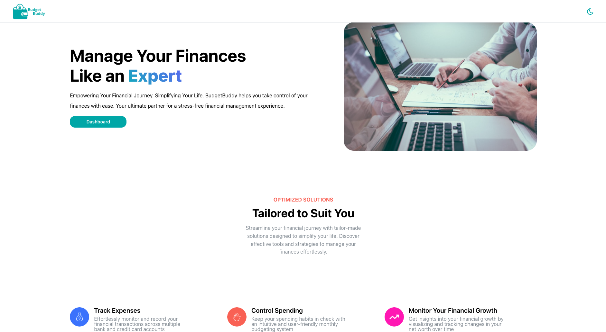
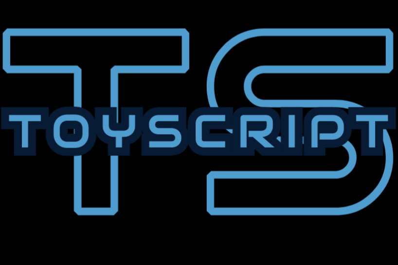

<h1 align="center">Hi 👋, I'm Abi Liu</h1>
<h3 align="center">A passionate full-stack developer from San Francisco, California.</h3>

  

- 📝 Code samples: [Sample 1](https://github.com/Abi-Liu/ToyScript/blob/main/src/Parsing/parser.js) • [Sample 2](https://github.com/Abi-Liu/Valorant-Team-Finder/blob/main/backend/src/controllers/match.ts) • [Sample 3](https://github.com/medplum/medplum/pull/2614/commits/01c5701d6791993b547da6a1bfbe582f5028f7c0)

- 🔭 I’m currently building a [real-time terminal based chat application with Go](https://github.com/Abi-Liu/TextTunnel)

- 🌱 I’m currently learning [**Golang**](https://go.dev/)

- 👨‍💻 All of my projects are available at [abiliu.netlify.app](https://abiliu.netlify.app)

- 📫 How to reach me **abiliu018@gmail.com**

- 📄 Download my resume [here](https://github.com/Abi-Liu/Resume/raw/main/resume.pdf)

<h1 align="center">Projects</h1>

 Please allow for slow loading times due to free hosting!

<table bordercolor="#66b2b2">
  <tr>
</tr>
   <tr> 
      <td width="50%" valign="top">
      <h3 align="center">BudgetBuddy</h3>
       
        
       
        

  
  
      

        
<strong>React, Node/Express, Docker, Postgres, Redis, Websockets, Nginx, AWS </strong> - A new and improved version of my previous app, FinanceMe

    </td>
    <td width="50%" valign="top">
      <h3 align="center">ToyScript</h3>
         
      
         
        

  
  
      

        
<strong>Javascript, Jest </strong> - A mini programming language I built from scratch using Javascript. Contains all the core features of a programming language.

    </td>
  </tr>
  <tr>
  <tr>  
    <td width="50%" valign="top">
      <h3 align="center">Valorant Finder</h3>
         
      
         
        

  
  
      

        
<strong>Typescript, React, MaterialUI, Node, ExpressJS, MongoDB, Jest, SuperTest </strong> - An application to track match history statistics and for users to find others to play with

    </td>
    <td width="50%" valign="top">
      <h3 align="center">FinanceMe</h3>
         
      
         
        

  
  
      

        
<strong>React, MaterialUI, Node, ExpressJS, MongoDB, PlaidAPI, Google Auth </strong> - WebApp to give users an easier time managing their finances.

    </td>
<!--     <td width="50%" valign="top">
      <h3 align="center">Jokr</h3>
         
        
         
        

  
  
      

        
<strong>MongoDB, Express, Node, EJS, Passport, Bootstrap 5</strong> - A web application where users can post their favorite jokes.

    </td> -->
  </tr>
</table>

<h3 align="left">Connect with me:</h3>

<h3 align="left">Languages and Tools:</h3>

&nbsp;

